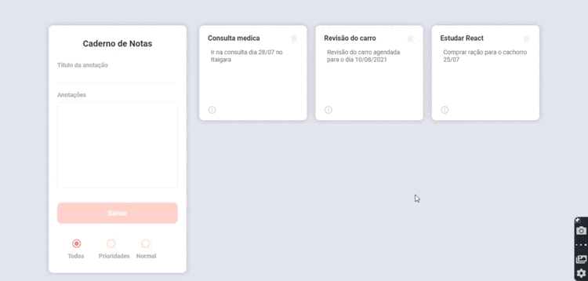

<h1>DevNotes</h1>
<h4>Aplicação de bloco de notas para gerenciamento de tarafeas</h4>

 STATUS:✔️ concluido  

  <h4>🔧 skills</h4>
<ul>
    <li><strong>NODE.JS</strong></li>
    <li><strong>EXPRESS</strong></li>
    <li><strong>MONGO.DB</strong></li>
    <li><strong>REACT.JS</strong></li>
</ul>

<h2>Apresentação</h2>

    Este projeto é uma simploria reconstrução de um bloco de notas.Porém 
    o seu desenvolvimento irar abordar conceitos fundamentais que servirão para construção de grandes projetos.

<h4>BACKEND</h4>
<ul>
    <li><strong>estrutura de pastas no padrão MVC;</strong></li>
    <li><strong>abstração de banco de dados com o ORM MONGOOSE;</strong></li>
    <li><strong>criação de rotas para comunição de aplicação;</strong></li>
    <li><strong>API RESTfull com as 4 operação CRUD;</strong></li>
</ul>

<h4>FRONTEND</h4>
 <ul>
     <li><strong> comunicação de componentes através de PROPS;</strong></li>
     <li><strong>react HOOKS para melhorar  as logicas dos componentes;</strong></li>
     <li><strong>react HOOKS para melhorar  as logicas dos componentes;</strong></li>

     
</ul>

🚀 <h5>Como rodar</h5>

Escolha uma pasta e faça um clone do projeto em sua maquina com o comando "git clone <https://nome-do-link>"

 
Em seguida digite o comando "npm install"

 
Com as dependencias instaladas navegue a ate a pasta "backend" e no terminal rode o comando "npm start"

 
Com a API rodando navegue até a pasta "frontend" e rode o comando "npm start" 

<h4>Obrigado pela visita e volte sempre!!!</h4>

